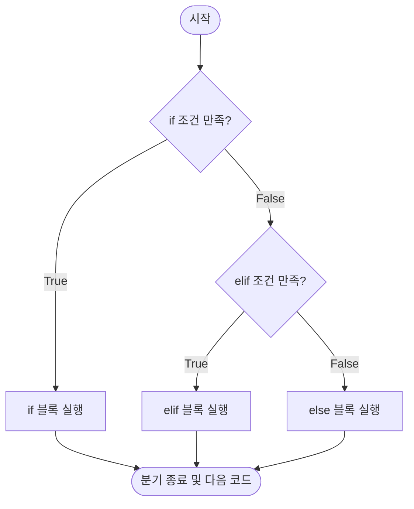
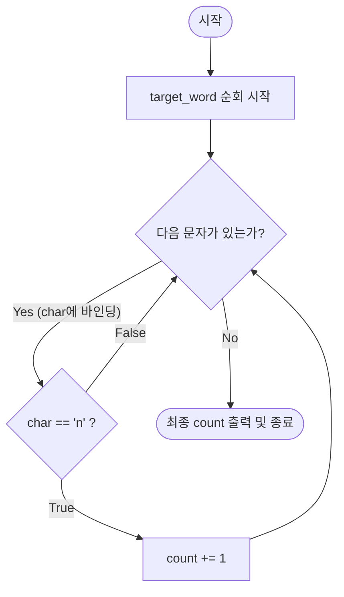
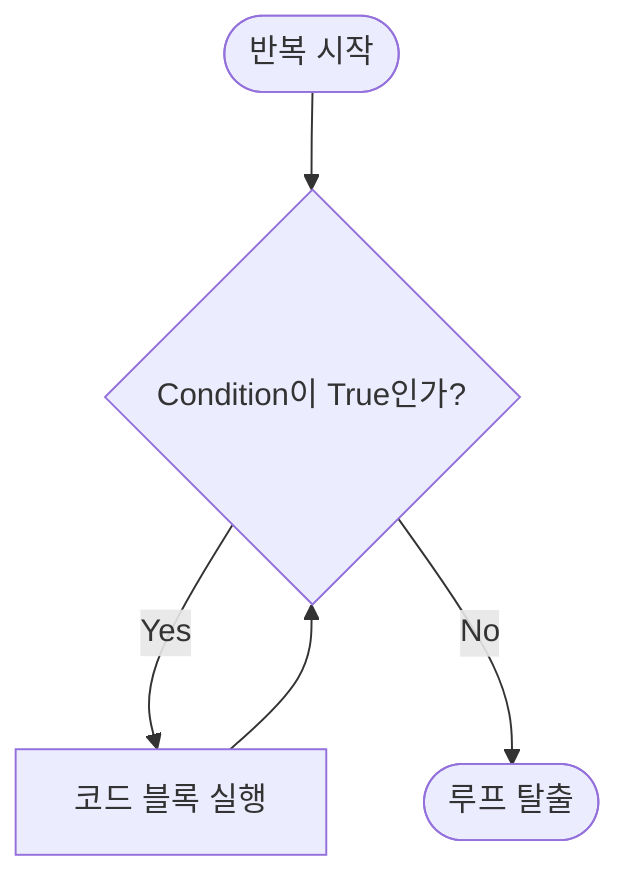

## **1 . 문자열과 입출력 (Strings & I/O) 

### **(1) String: 데이터의 확장**

- **정의**: 문자, 특수문자, 공백, 숫자를 포함하는 객체로, 따옴표(`'` 혹은 `"`)로 정의한다.
    
- **연산의 메커니즘**:
    
    - **Concatenation (`+`)**: 두 문자열을 물리적으로 연결한다.
        
    - **Succession (`*`)**: 문자열을 정수(int)만큼 반복 생성한다.

예1) 
```
>print('Concatenation: ''python' + 'is' + 'smart')  
>print('Succession: ''python is smart' * 3)  
  
#cf) Concatenation 에서 중간에 공백을 넣고 싶다면 다음과 같은 방식을 이용한다.  
  
>print('Concatenation 2nd: ''python' + ' ' + 'is' + ' ' + 'smart')

Concatenation: pythonissmart
Succession: python is smartSuccession: python is smartSuccession: python is smart
Concatenation 2nd: python is smart
```

 **[Remark]** 
 문자열과 숫자 사이의 직접적인 `+` 연산은 **Static Semantics Error**를 유발한다. 
 반드시 형 변환이 선행되어야 한다

**[Necessity] f-string: 문자열 바인딩의 혁신**

**(1) 왜 f-string인가?**

- **기존 방식의 모순**: 서로 다른 데이터 타입을 `+` 연산으로 결합할 때, 매번 `str()`를 호출하여 **명시적 형 변환**을 강제해야 하는 구조적 번거로움이 존재한다.

- **해결책**: f-string은 문자열 내부에 객체를 직접 **바인딩(Binding)** 함으로써, 
  가독성을 비약적으로 높이고 타입 불일치로 인한 `TypeError` 발생 가능성을 원천 차단한다

 **(2) Analysis**

- **Syntax**: 문자열 리터럴의 시작점(`"`) 앞에 접두어 `f`를 붙여 정의한다.
    
- **동적 바인딩**: 중괄호 `{ }` 내부의 식(Expression)은 런타임에 평가되어 해당 위치에 문자열로 치환된다.

예2)
```
>x = 10  
>y = 20  
>z = '30'  
  
>print(f'{x} + {y} = z')  #Case 1
>print(f'{x} + {y} = {z}') #Case 2

10 + 20 = z
10 + 20 = 30
```


**[Analysis]  결과값의 당위성 검토**

1. **Case 1 (`z`)**:
     f-string 내부라도 중괄호 `{ }`가 없는 문자는 단순한 **리터럴 텍스트**로 인식된다.
     즉, 변수 `z`가 가리키는 객체 '30'을 찾아가는 것이 아니라, 알파벳 'z' 그 자체를 출력한다.
        
2. **Case 2 (`{z}`)**:
     중괄호는 파이썬에게 "이 안에 있는 것은 변수(식별자)이니 메모리에서 해당 객체를 찾아와라"라는 
     **바인딩 명령**을 내린다.
     결과적으로 변수 `z`에 담긴 문자열 '30'이 성공적으로 호출되어 출력된다.
     
#### **[Remark 1] f-string의 유연한 자동 형 변환**
 `x`와 `y`는 **`int`** 타입이고, `z`는 **`str`** 타입이다.
 기존의 `+` 연산 방식이었다면 `str(x) + " + " + str(y) + " = " + z`와 같이 피곤한 형 변환 과정이 필요했겠지만
 f-string은 중괄호 안의 객체가 어떤 타입이든 출력 시점에 **유기적으로 문자열화**하여 결합한다.   
이것이 우리가 f-string을 선택해야만 하는 이유라 볼 수 있다.
#### **[Remark 2] Semantics(의미론적) 주의사항**
Case 2의 출력 결과인 `10 + 20 = 30`은 수학적으로 참이다.
하지만 여기서 `10 + 20`은 **연산의 결과**가 아니라 각 변수 `x`, `y`가 출력된 것뿐이고,
`30` 또한 계산된 값이 아니라 변수 `z`에 저장된 **문자열**일 뿐이다.
만약 `{x + y}`라고 썼다면 파이썬은 내부에서 실제 덧셈 연산을 수행했을 것이다.


### **(2) Input/Output의 엄밀성**

- **`print`**: 가시적인 데이터를 콘솔에 출력하는 도구이다.
    
- **`input`**: 사용자로부터 데이터를 받아 변수에 **바인딩(Binding)** 한다

예3)
```
>age = input('age =')  
>print(f'age is {age}')

age =21 #(입력 받은 수)#
age is 21 
```

- **[Check Point] Casting의 필연성**:
    
    - `input` 함수는 입력값을 **무조건 문자열(`str`)** 로 반환한다.
        
    - 따라서 산술 연산에 활용하기 위해서는 `int()` 또는 `float()`를 통한 **명시적 형 변환**이 필수적이다.
예4)
```
>str = input('1 + 1 = ')  
>print('str type : ',type(str))  
  
>int = int(input('2 + 2 = '))  
>print('int type : ', type(int))  
  
>flt = float(input('3 + 3 = '))  
>print('float type : ', type(flt))

1 + 1 = 2
str type :  <class 'str'>
2 + 2 = 4
int type :  <class 'int'>
3 + 3 = 6
float type :  <class 'float'>

```


---

## **2. 제어 흐름의 도구: Comparison & Logic**

### **(1) 비교 연산자 (Comparison Operators)**

- 변수 사이의 관계를 평가하여 **Boolean(`True`/`False`)** 값을 도출한다
    
- `==`(동등성), `!=`(불등성), `>`, `>=`, `<`, `<=` 등이 존재한다.
    
### **(2) 논리 연산자 (Logic Operators)**

- **`not a`**: 상태를 반전시킨다.
    
- **`a and b`**: 두 조건이 모두 참일 때만 참을 반환한다.
    
- **`a or b`**: 하나 이상의 조건이 참이면 참을 반환한다.

**[Remark] 논리 연산자에 대한 수학적 이해**

프로그래밍의 논리 연산은 수학의 **집합론(Set Theory)** 및 **확률론**과 완벽하게 궤를 같이한다.
- **`not a` : 여집합 ($A^c$)**
    
    - 사건 $a$가 발생하지 않는 영역을 의미한다.
        
    - 상태의 **반전**을 통해 논리적 배타성을 확보한다.
        
- **`a and b` : 교집합 ($A \cap B$)**
    
    - 사건 $a$와 사건 $b$가 **동시에** 만족되는 영역이다.
        
    - 두 조건이 모두 `True`여야만 전체가 `True`가 되는 엄밀성을 가진다.
        
- **`a or b` : 합집합 ($A \cup B$)**
    
    - 사건 $a$ 또는 사건 $b$ 중 **적어도 하나**가 만족되는 영역이다.
        
    - 두 사건 중 하나만 발생해도 `True`를 반환하며, 교집합 영역까지 포함하는 포괄적 개념이다


**[Analysis] 진리표(Truth Table)를 통한 당위성 검토**

| **A**     | **B**     | **A and B (∩)** | **A or B (∪)** |
| --------- | --------- | --------------- | -------------- |
| **True**  | **True**  | **True**        | **True**       |
| **True**  | **False** | False           | **True**       |
| **False** | **True**  | False           | **True**       |
| **False** | **False** | False           | False          |

**[Check Point]** 
프로그래밍에서 조건문을 작성할 때, 
복잡한 논리 구조는 **드 모르간의 법칙(De Morgan's laws)** 을 사용하여 간소화할 수 있다. 
이는 수학적 집합 연산의 성질이 프로그래밍의 **Control Flow** 에 직접적으로 개입하는 지점이다.

---

## 3. 분기와 반복 (Branching & Iteration)

**(1) Branching (분기: `if`, `elif`, `else`)**

- **메커니즘**: 조건식($<condition>$)의 불리언 값(`True` / `False`)에 따라 
  특정 코드 블록의 실행 여부를 결정한다.
    
- **Indentation(들여쓰기)**: 파이썬에서 들여쓰기는 단순 가독성 도구가 아니라, 코드 블록의 종속 관계를 결정하는 **문법적 실체**이다.

    

**[Necessity] 분기문의 필연적 등장 배경**

- **모순**: 프로그램이 위에서 아래로만 흐른다면(Linear Flow), 모든 입력값에 대해 동일한 연산만을 수행할 수밖에 없다.
    
- **해결책**: 특정 조건에서만 실행되는 **배타적 영역**을 설정함으로써, 프로그램이 상황에 맞게 반응하고 
  스스로 판단하는 지능적 구조를 갖추게 한다

예1)
```
x = int(input("x = ")) # [1] 
y = int(input("y = ")) # [1]

if x > y:              # [2]
    print(f'x > {y}')
elif x == y:           # [3]
    print(f'x = {y}')
else:                  # [4]
    print(f'x < {y}')
```

**[Analysis] 

1. **[1] Casting의 당위성**: `input()`으로 들어오는 데이터는 문자열(`str`)이다. 
   만약 `int()`로 형 변환을 하지 않았다면, 숫자 대소 비교 시 `TypeError`가 발생했을 것이다.
    
2. **[2] 첫 번째 관문 (`if`)**: 가장 먼저 `x > y` 여부를 판단한다. 
   이 조건이 `True`라면 아래의 모든 과정은 생략되고 즉시 종료된다.
    
3. **[3] 배타적 선택 (`elif`)**: `if` 조건이 `False`일 때만 넘어온다. 
   즉, 이 지점에 도달했다는 것 자체가 이미 `x <= y`임을 내포하고 있다.
    
4. **[4] 논리적 귀결 (`else`)**: 위 두 조건이 모두 `False`인 경우, 수학적으로 남은 케이스는 `x < y`뿐이다. 
   따라서 별도의 조건식 없이 `else`로 처리하는 것이 가장 효율적이다

### **(2) Iteration (반복: `while`, `for`)**

- **`while` Loop**: 루프 시작점에서 조건을 검사하고, 참인 동안은 내부 코드를 무한히 재실행한다.
    
- **`for` Loop**: `range()`와 같은 정해진 시퀀스(Sequence) 내에서 **반복 횟수가 확정된** 경우에 주로 사용한다.
  `range(start, stop, step)`: `start`에서 시작하여 `stop - 1`까지만 도달하는 인덱스 구조를 가짐에 유의할 것.

### **[Remark] 인덱스(Index): 데이터의 주소와 반복의 통제**
#### **(1) 정의와 실체**

- **인덱스**란 시퀀스 데이터 타입(String, List 등) 내에서 특정 객체가 점유하고 있는 
  **상대적 위치(Relative Position)** 를 나타내는 정수이다.
    
- 파이썬의 인덱스는 **0-based (Zero-indexing)** 체계를 따르며, 
  이는 메모리의 시작점으로부터의 거리를 의미한다.
#### **(2) 인덱스는 왜 `for` 루프의 '키(Key)'인가?**

- **모순**: 반복문이 단순히 데이터만 꺼내온다면, 
  우리는 "지금이 몇 번째 반복인지" 혹은 "특정 위치의 값만 수정하고 싶다"는 요구사항을 해결할 수 없다.
    
- **해결책**: `range()`라는 도구를 통해 **가상의 인덱스**를 생성하고,
  이를 루프 변수(주로 `i`)에 **바인딩(Binding)** 함으로써 반복의 주도권을 확보한다.


**[Necessity] 반복문의 존재 당위성**

- **모순**: 인간이 수작업으로 처리하기 힘든 방대한 양의 반복 업무를 코드의 나열로 처리하는 것은 
  불가능에 가깝다.
    
- **해결책**: 조건 기반의 **순환 구조**를 구축하여, 단 몇 줄의 코드로 인간의 한계를 넘어서는 
  대규모 계산과 데이터 처리를 수행한다.

예2) 인덱스를 활용한 조건부 연산 (Filtering)
```
>even_sum = 0  
>for i in range(1, 11): # [1] range(1, 11) → Index: 1, 2, ..., 10  
>if i % 2 == 0:     # [2] 인덱스 i가 짝수인지 판정 (상태값 활용)
>	even_sum += i  
>	print(f"짝수 발견: {i}, 현재 누적 합: {even_sum}")

짝수 발견: 2, 현재 누적 합: 2
짝수 발견: 4, 현재 누적 합: 6
짝수 발견: 6, 현재 누적 합: 12
짝수 발견: 8, 현재 누적 합: 20
짝수 발견: 10, 현재 누적 합: 30
```

**[Analysis]  range의 수치적 엄밀성**

	`range(1, 11)`에서 `1`은 시작점(inclusive), `11`은 정지점(exclusive)이다.
	 따라서 인덱스 `i`는 `1`부터 `10`까지 정확히 10번의 상태 전이를 일으킨다

예3) 문자열 시퀀스 순회 (Object Iteration)
```
>target_word = "Computational Thinking" # [1]  
>count = 0                              # [2]  
  
>for char in target_word:               # [3]  
>    if char == 'n':                    # [4]  
>        count += 1                     # [5]  
  
>print(f"문자 'n'의 개수는 {count}개") # [6]
```

**[Analysis] : 시퀀스 직접 순회를 통한 객체 탐색**
#### **1. [1] 데이터의 구조와 성질**

- `target_word`는 문자열(`str`) 객체로, 파이썬에서 **시퀀스(Sequence)** 데이터 타입에 해당한다.
    
- 시퀀스 타입은 내부적으로 인덱스 체계를 가지고 있어, `for` 루프를 통해 요소를 하나씩 순차적으로 꺼낼 수 있는 **반복 가능성(Iterable)**을 확보한다.
#### **2. [2] 카운터 변수의 필연성**

- `count = 0`은 특정 사건(문자 'n'의 발견)의 발생 횟수를 저장하기 위한 **상태 변수**이다.
    
- 루프가 시작되기 전 반드시 `0`으로 초기화되어야만 정확한 누적 연산이 가능하다.
#### **3. [3] `for` 루프의 바인딩 메커니즘**

- `for char in target_word:` 문장에서 `char`는 매 루프마다 문자열의 문자 하나하나를 가리키는 **임시 식별자** 역할을 한다.
    
- 인덱스 번호를 명시적으로 호출(`target_word[i]`)하지 않아도, 파이썬이 내부적으로 다음 객체를 자동으로 `char`에 **바인딩(Binding)** 해준다.
    

#### **4. [4~5] 조건문과 누적 연산**

- **[4]**: 비교 연산자(`==`)를 통해 현재 `char`에 담긴 객체가 목표 객체(`'n'`)와 동일한지 판단한다.
    
- **[5]**: 조건이 `True`일 때만 `count` 값을 `1`씩 증가시킨다(`count += 1`). 이는 루프 전체를 통틀어 특정 사건의 총합을 구하는 핵심 로직이다.
    
#### **5. [6] f-string을 활용한 결과의 바인딩**

- 최종 결과 출력 시 **f-string**을 사용하여 계산된 `count` 값을 문자열 내에 유기적으로 결합한다.
    
- 이는 앞서 배운 **[Necessity]**인 가독성과 엄밀성을 동시에 충족하는 출력 방식이다.
    


예4) `while` 루프: 비결정적(Unbounded) 상황의 제어

```
# [Analysis]: 특정 숫자를 맞출 때까지 반복되는 Guessing Game
>secret_number = 7
>guess = 0 # [1] 초기화의 필연성

>while guess != secret_number: # [2] 조건식의 엄밀성
>    guess = int(input("1~10 사이의 숫자를 맞춰보세요: ")) # [3] Casting
    
>   if guess > secret_number:
>        print("너무 커요! 다시 시도하세요.")
>    elif guess < secret_number:
>      print("너무 작아요! 다시 시도하세요.")
        
>print(f"정답입니다! {secret_number}를 맞추셨네요.") # [4] f-string 바인딩
```


**[Analysis]**
- **[1] 초기화(Initialization)**: `while` 문은 진입 전 조건을 검사한다. 만약 `guess` 변수를 미리 선언하지 않는다면, 첫 번째 조건 검사에서 `NameError`가 발생하여 프로그램이 붕괴된다.
    
- **[2] 루프의 지속성**: 조건식(`guess != secret_number`)이 `True`인 동안은 내부 블록이 무한히 재실행된다. 반복 횟수를 사전에 알 수 없으므로 `for`가 아닌 `while`을 선택한 것은 논리적 **[Necessity]** 에 부합한다.
    
- **[3] 데이터 타입의 일치**: `input()`은 무조건 문자열(`str`)을 반환한다. 
  숫자 대소 비교 연산(`!=`, `>`, `<`)을 수행하기 위해서는 반드시 `int()`를 통한 **명시적 형 변환**이 
  선행되어야 한다.
    
- **[4] 상태 전이**: 루프 내부에서 `guess` 값이 업데이트되어야만 조건 검사 결과가 `False`로 바뀔 가능성이 
  생긴다. 이를 망각하면 메모리를 고갈시키는 **무한 루프(Infinite Loop)** 에 빠지게 된다.
    




**[Remark 1] `break` Statement의 단호함**
  루프 내부에서 특정 조건 만족 시, 남은 연산을 모두 스킵하고 **가장 인접한(Innermost)** 반복문을 
  즉시 탈출한다.
    
**[Remark 2] 반복문의 선택: `while` vs `for`**
  모든 `for` 루프는 `while`로 재작성 가능하지만 , 사용자 입력처럼 종료 시점이 불분명한 
  일부 `while` 루프는 `for`로 치환하기 매우 까다롭거나 불가능하다.
  따라서 반복의 **'횟수'** 가 중심이라면 `for`를, **'상태와 조건'** 이 중심이라면 `while`을 선택하는 것이 논리적이다.
        
    